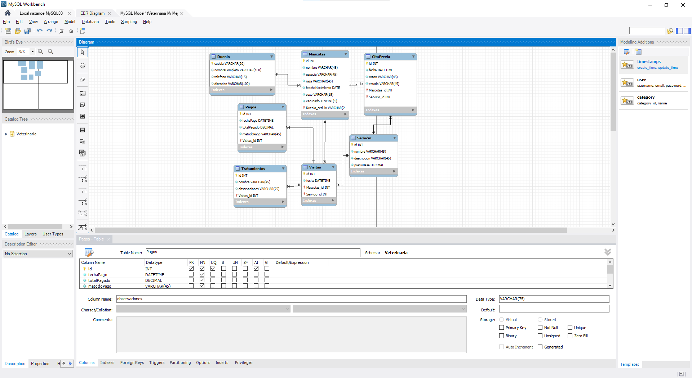

## UML E-R Design

---

## Steps to Run the Project

### 1. Create the Database and Tables (`estructura.sql`)

- Open `estructura.sql`
- Connect to the database using an extension (e.g., in Visual Studio Code)
- Run the code

This will:
- Drop the database if it exists
- Create the `Veterinaria` database
- Define all tables and relationships

---
### 2. Insert Sample Data (`datos.sql`)

- Open `datos.sql`
- Execute the entire file

This will add:
- 5 Owners
- 10 Pets
- 5 Services
- 10 Visits
- 5 Treatments
- 5 Payments
- 5 Appointments
---

### 3. Query Data (`consultas.sql`)

- Open `consultas.sql`
- Run each query one by one or execute the entire file

You will see:
- Queries using functions, aliases, and subqueries
- Grouping, rounding, concatenations, etc.
- Creation of a table from a query

💡 If you don't see any results:
- Make sure you are connected
- Open the results panel
- Check the **"OUTPUT"** or **"RESULTS"** tab at the bottom depending where youre running the queries
---